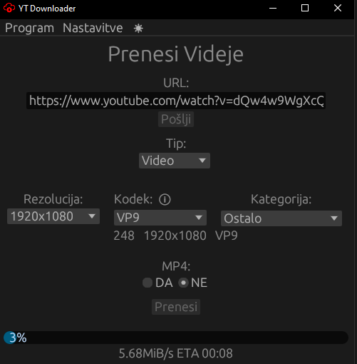
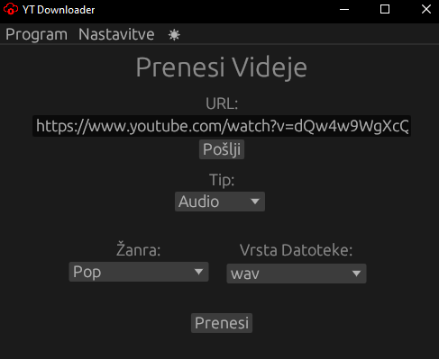
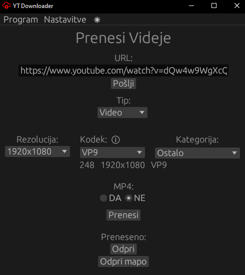
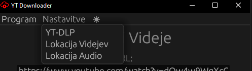

# YTDownloaderGUI

**Preprost YT video/music downloader.**

**Dela samo na _windows_ sistemih!**

Projekt je lepši izgled [YT-DLP](https://github.com/yt-dlp/yt-dlp) projekta.

 

## Izgled in Funkcionalnost

Imamo možnost prenosa **video ali audio** datoteke. 

### Video
Izberemo lahko **rezolucijo** videja za prenos.
Poleg tega lahko izbiramo kakšen **kodek** se bo prenesel. Lahko tudi izberemo med katero **kategorijo** se naj shrani video npr. Šport, Igrice, Znanost... 

Prevzeto se prenese datoteka, ki ni mp4, saj se s tem ne izgobi kvaliteta videja. Če pa želimo prenesiti MP4 video, pa to samo označimo.

Čisto spodaj se pa izpiše napredek v procentih, ter hitrost prenosa in čas do konca prenosa.

### Audio

Izbiramo lahko med **žanrami** npr. Pop, Hardstyle, Coutry...
Na koncu pa še lahko izberemo **vrsto datoteke**, ki se naj shrani to so wav, mp3, m4a, aac. 

### Končan prenos

Po končanem prenosu se nam prikažeta dva gumba, kjer lahko izberemo ali se nam odpre prenesena datoteka oz. mapa kjer se je shranila.

## Nastavitve in Napredno

### Nastavitve
Pred pričektom prenosa moramo nastaviti pot do **YT-DLP programa _(ffmpeg in ffprobe sta potrebna za pravilno dovoljeneje)_.** Prenesete jih lahko na navedenih povezavah [YT-DLP](https://github.com/yt-dlp/yt-dlp) in [ffmpeg ter ffprobe](https://github.com/yt-dlp/FFmpeg-Builds#ffmpeg-static-auto-builds)

 

Moramo tudi nastaviti **lokacijo za shranjevanje video in audio** datotek.

### Napredno

Po uspešni namestitvi programa, se nam ustvari mapa assets, ki vsebuje dve mapi. To mapo lahko najdemo prevzeto pod `C:\Program Files (x86)\YT Downloader GUI`. V mapi config najdemo datoteki `KategorijeVidejev.json` ter `ZanraPesmi.json`, ti datoteki lahko uredimo in s tem dodamo/spremenimo/izbrišemo kategorijo oz. žanro. Za spremembe moramo ponovno zagnati aplikacijo.